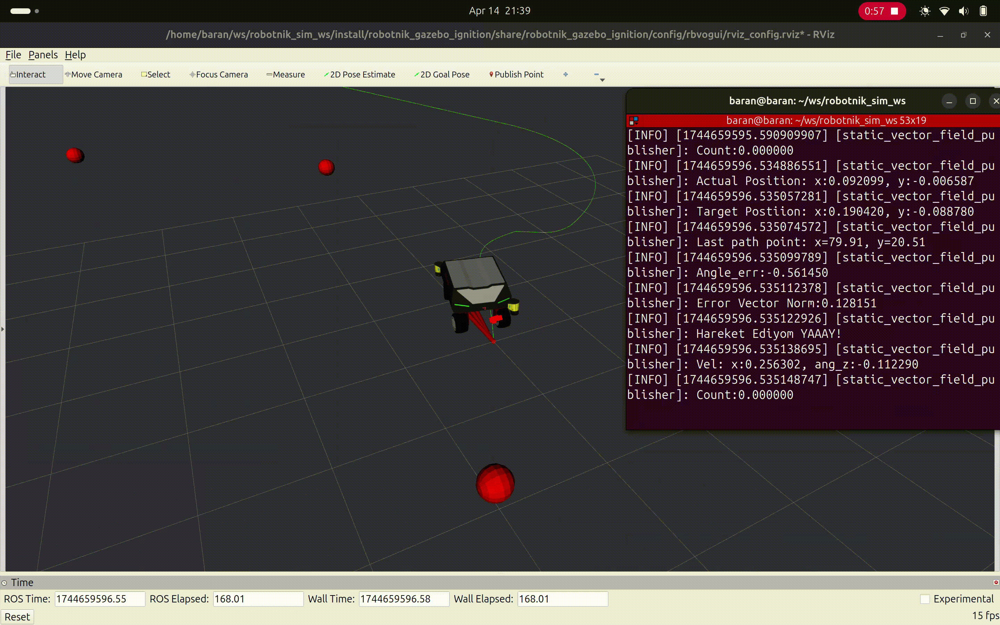

# ROS-2-Exercises

This repository contains my ROS 2 exercises and projects, created for learning purposes.

## my_ik_solver
This project implements a simple numerical inverse kinematics solver using the Gradient Method for the UR5 robot, based on its Denavit-Hartenberg (DH) parameters.

## basic_path_planning
This package implements a basic path planning and obstacle avoidance algorithm for controlling a turtle in the TurtleSim environment using ROS 2.

## my_vector_field
The Vector Field method is a local path planning algorithm. I implemented it based on my lecture notes using C++ and integrated it into the Robotnik robot simulation (RobotnikAutomation/robotnik_simulation). Since the Robotnik simulation does not provide odometry by default, I also wrote an odometry publisher in C++. It is included in the same my_vector_field package as odom_publisher.cpp. Here's a GIF of the result:

## rviz_marker_controller
This package provides interactive markers in RViz for controlling a robot using Twist messages. Since the robot features a steering mechanism, the interface supports movement along the linear X, linear Y, and angular Z axes. Users can intuitively drag the interactive arrows in RViz to generate velocity commands, making it easier to manually control the robot during development and testing.